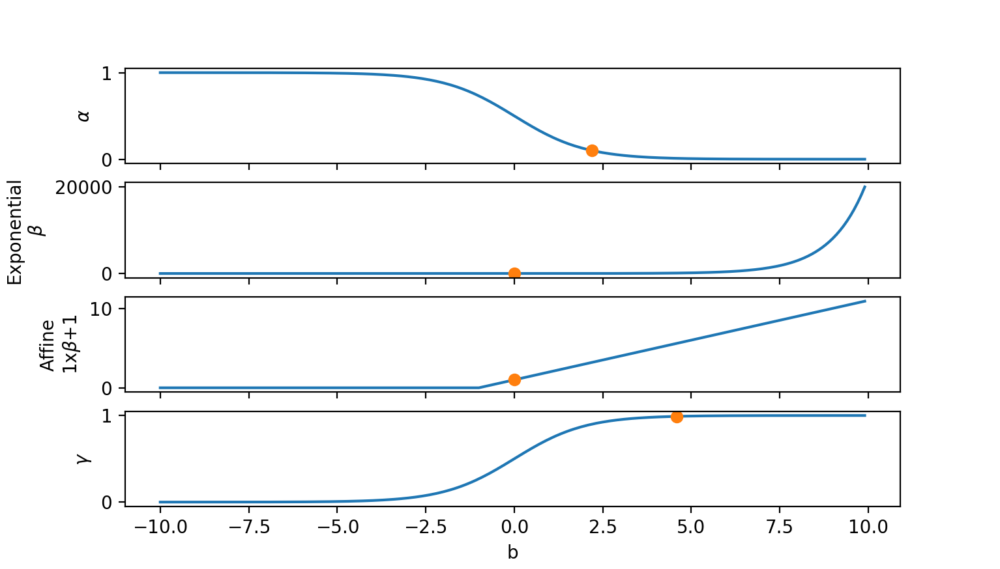
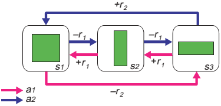
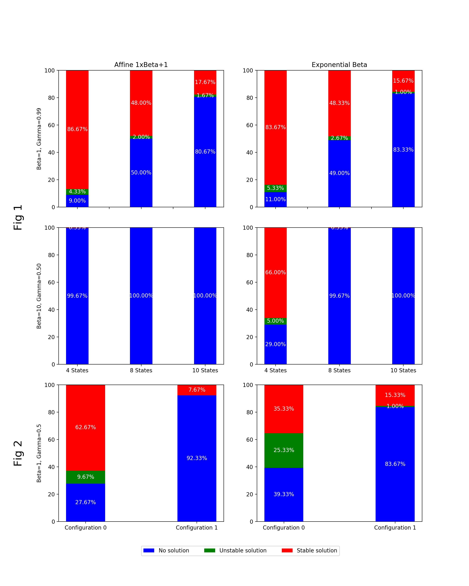

# Introduction

The original manuscript [@schweighofer2003meta] proposes stochastic meta-learning rules which allow for automatic adjustment of the meta-parameters of reinforcement learning, namely the learning rate $\alpha$, the inverse temperature $\beta$, and the temporal discount $\gamma$. These meta-paramaters have a strong influence on the learning process, since they condition how quickly the environment's values are learned, the balance between exploration and exploitation, and the degree to which long-term rewards are considered. As such, the question of which values to choose for these meta-parameters is paramount in order to obtain a decent performance. Traditionally, this is done by hand, with a certain degree of knowledge of the task. However, autonomous agents, who could independently learn and evolve in an environment, cannot know such task-related knowledge beforehand. Furthermore, adjusting meta-parameters allows agents to adapt to changing environments. Therefore, many meta-learning rules for the automatic adjustment of meta-parameters have been proposed **(refs?)**. Schweighofer & Doya propose a biologically plausible stochastic and adaptive alternative, robust to environment changes in static and dynamic environments [@schweighofer2003meta].

The present replication is not based on previous implementations, and uses Python 2.7 with the joblib library. We chose to replicate Figure 1 and 2 of the article and focus on discrete-time tasks, since our results greatly differ from the original results and that continuous-time tasks further complicate the analysis. Finally, we propose an alternative non-stochastic version of this meta-learning algorithm, which allows the agent's performance to robustly converge to a stable solution but also depends upon the meta-parameter's initial conditions.  

# Methods

## Overview
As the original code implementation wasn't found when contacting the authors, we followed the paper description of the methods as closely as possible while modifying inconsistencies.  
We replicate Fig. 1 and Fig. 2, in which the agent evolves in a discrete Markovian Decision Problem task inspired from [@tanaka2004prediction]. We tested the algorithm's performance over 300 trials for multiple combinations of conditions claimed in the original manuscript, such as in the meta-parameter initial values, or number of states.  
However, we did not vary the base reinforcement learning method, adopting Q-learning in all simulations, nor the number of meta-parameters that could be adjusted, opting for all three meta-parameters being adjusted. These choices were done to match the conditions shown in the original paper's Figures 1 and 2.  
Furthermore, seeing as the exponential form of $\beta$'s meta-learning equation could make $\beta(t)$ climb to unrealistic values (~$10^7$) which possibly impeded on the agent's performance, we also tried an affine meta-learning equation following previous research **(ref Mehdi Khamassi's work with $\beta$)**.

## Modifications of equations
The meta-learning equations we chose were:
$$
\begin{array}{c}
\alpha(t) = \frac{1}{1 + e^{\alpha_{b}(t)}} \in [0;1] \\
\beta(t) = e^{\beta_{b}(t)} \in [0;+\infty[ $  (exponential form)$ \\
\beta(t) = \beta_{b}(t)+1 \in [0;+\infty[ $  (affine form)$ \\
\gamma(t) = 1 - \frac{1}{1 + e^{\gamma_{b}(t)}} \in [0;1]
\end{array}
$$ {#eq:1}
The meta-learning equations for $\gamma(t)$ are specified in the original manuscript. However, they dictate that $\gamma(t) \in [-\infty;1]$, which is non-sensical. We interpret this as a typo, with a missing +1 on the denominator, adapting the equation with parcimony.  
The meta-learning equations of $\beta(t)$ and $\alpha(t)$ are vaguely specified as "exponential".  
For $\beta$, we straight-forwardly tested an exponential equation, and a parcimonious affine alternative (since exponential beta leads to absurdly high values).  
Finally, seeing as generally $\alpha \in [0;1]$ contrary to the original manuscript's claim but consistent with $\alpha$'s value in their figures, we adapted $\gamma$'s equation by changing the sigmoid's direction (see Results, Noiseless version).  
The equations are depicted in @fig:meta.

{#fig:meta}

The other meta-learning equations were left unmodified.
In all figures, $\alpha$ was initially set at 0.1 instead of 0, since $\alpha=0$ leads to $\alpha_b=\infty$, and the algorithm rarely converged when $\alpha<0.1$.

## Detail of tested conditions for each figure
* Figure 1:
    * Different $\beta$ meta-learning rules: exponential ($\beta(t) = e^{\beta_b}(t)$), or affine ($\beta(t) = \beta_b(t)+1$)
    * Different meta-parameter initial conditions: $\beta = 1$ & $\gamma = 0.99$, or $\beta = 10$ & $\gamma = 0.5$
    * Different number of states and large reward in the MDP task: states = 4, 8, or 10 and large rewards = 6, 12, or 15 respectively
    * No environment switches
    * 50.000 steps
* Figure 2:
    * Different $\beta$ meta-learning rules: exponential ($\beta(t) = e^{\beta_b}(t)$), or affine ($\beta(t) = \beta_b(t)+1$)
    * Unique meta-parameter initial condition: $\beta = 1$ & $\gamma = 0.5$
    * Unique number of states in the MDP task: 8 states
    * 1 environment switch, in which the large reward is changed from 2 to 12 at step n°20.000
    * 40.000 steps

## MDP task

{#fig:MDP}

Two choices, right or left, define the small proximal reward $r_1$ and the large future reward $r_2$ in Fig. @fig:MDP. In this 10-state MDP based upon [@tanaka2004prediction], $r_{1} = +1$ and $r_{2} = +15$, thus the agent requires long-term appreciation of rewards to avoid path $a_{1}$ (instantly rewarding but overall punishing) and favor $a_{2}$ (instantly punishing but overall rewarding).
Furthermore, the MDP can change, where the large reward $r_{2}$ is modified to test the agent's learning in a dynamic environment.

Defining n as the number of states, $r(a_p)$ the average reward the agent can expect when performing one full loop of path $a_p$, and $max_{<r>}$ the maximal average reward the agent can obtain, we have
$$
\begin{array}{c}
<r(a_1)> = \frac{-r_2+r_1(n-1)}{n} \\
<r(a_2)> = \frac{r_2-r_1(n-1)}{n} \\
max_{<r>} = max(<r(a_1)>, <r(a_2)>)
\end{array}
$$ {#eq:2}
For 10 states, $r_2=15$ and $r_1=1$, this becomes $<r(a_1)> = (-15+9)/10 = -0.6$ and $<r(a_2)> = max_{<r>} = 0.6$.

## Classification of trials
**Cette partie refuse de bien formatter la liste / les bullets points pour une raison qui m'échappe: la conversion markdown-->latex-->pdf peut mener à des surprises.**  
We classified the 300 trials of each figure condition into three categories:  
1. No solution: the algorithm never converges.  
Convergence is detected when the long-term estimate of the instantaneous reward $\overline{\overline{r}}(t)$ goes beyond a certain threshold (such as 95% of maximal possible reward). This writes $\overline{\overline{r}}(t) > (1-\epsilon) * max_{<r>}$ (see equation @eq:2), with $\epsilon=0.05$.
2. Unstable solution: the algorithm does converge, but afterwards loses the found solution due to unstable learning of Q-values.  
If the long-term averaged reward dips too low once the agent converged ($\overline{\overline{r}}(t) < 0.75 * max_{<r>}$) or stays converged ($\overline{\overline{r}}(t) > (1-\epsilon) * max_{<r>}$) less than 90% of the remaining time, the solution found is unstable.  
3. Stable solution: the algorithm does converge, and the solution found is not unstable.

# Results
## Classification
In the original manuscript, Figure 1 and 2 show single trials. As such, our first endeavour was to verify over how many trials these examples could be replicated. We thus repeated each condition over 300 trials, classifying each trial according to whether the agent has successfully converged or not and whether the solution is stable (see Methods, Classification of trials).  
Fig. @fig:percent shows us these proportions, for different conditions claimed but not shown in [@schweighofer2003meta] (number of states, meta-parameter initial conditions), as well as the chosen $\beta$ equation.

{#fig:percent}

Firstly, concerning the original manuscript's Figure 1 conditions, no solution is found for the meta-parameter initial conditions $(\beta=10, \gamma=0.5)$ except for exponential $\beta$ & 4 states. Indeed, $\beta$ starts very high and $\gamma$ very low. As such, the agent prioritises exploitation instead of exploration, and strongly discounts past obtained rewards. In this specific MDP task (see Methods, MDP), the agent needs to ignore small negative rewards to obtain a large positive reward. This requires an initial exhaustive exploratory phase, as well as long-term perspective, both of which are not favored by the meta-parameters initial conditions. The noise $\sigma$ isn't large enough for the meta-parameters to try good values (for e.g. $\beta=10$ vs $<1$, $\gamma=0.5$ vs $>0.9$) and the reward differential ($\overline{\overline{r}}-\overline{r}$) never increases, which leads to no update of the meta-parameters and thus no solution (see Figure A).

**Ici, il est difficile de conclure quant à la contribution de chaque meta-paramètre: beta grand est-il plus limitant que gamma petit?**

Secondly, as the number of states grows and the large reward distanced, the percentage of converged solutions decreases. Indeed, the algorithm requires greater exploration and long-term perspective to solve the task. As such, meta-parameters must be kept within even more constrained values (e.g. $\beta<0.5$ vs $<1$, $\gamma>0.95$ vs $>0.9$), and for a longer period of time (since the environment is longer). However, reducing the size of desired meta-parameter zones increases the probability that the stochastic update of their value removes them from such zones. Furthermore, the more states there are, the more the arbitrarily chosen $n=100$ steps for choosing new stochastic values cuts the learning short compared to the increased number of steps necessary to learn the larger environment.

**Figure A:  
a - Affine_1xBeta+1,_Fig_1,_Beta=10,_Gamma=0.50,_MDP_10_States_n°17.jpeg.  
Je n'arrive pas à l'inclure, car erreur latex bounding_box trop grand. Mais comment changer cela depuis markdown??**

Thirdly, concerning the original manuscript's Figure 2 conditions, learning in a dynamic environment where $r_2$ changes greatly decreases the percentage of converged solutions. The abrupt negative reward differential ($\overline{\overline{r}}-\overline{r}$) that comes with the environment switch leads to the agent learning the opposite direction of the $\sigma$ noise at that instant for each meta-parameter value. Since the $\sigma$ noise is chosen as Gaussian noise with mean 0, the probability of being negative or positive is $\frac{1}{2}$. As such, the probability of the $\sigma$ noise being in the required opposite direction for the meta-parameters to reset to good starting values ($\alpha$ high, $\beta$ low, $\gamma$ low) is $\frac{1}{2^3}=\frac{1}{8}$. The further the meta-parameters are from good reset values after this sudden change, the smaller the probability the meta-parameters will test good values and the agent learn the task correctly, the lesser the chance the reward differential will significantly diverge from 0 to allow for meta-parameter learning. For e.g., $\alpha$ or $\gamma$ could converge to 0 by chance (see Figure B).

**Figure B:  
b - Affine 1xBeta+1, Fig 2, Beta=1, Gamma=0.50, MDP 8 States n°6 (alpha converges to 0, no re-learning possible).  
c - Affine 1xBeta+1, Fig 2, Beta=1, Gamma=0.50, MDP 8 States n°7 (gamma converges to 0, Q-values reset). Pareil, bounding_box sera trop grand.**

Fourthly, the exponential $\beta$ meta-learning rule adapts better than the affine alternative, since stochastic changes in $\beta_{b0}$ affect $\beta$ much more, allowing it to re-start at values ~0 for exploratory purposes. This also explains the increased exponential $\beta$ performance in Figure 1, $(\beta=10, \gamma=0.5)$, 4 states, compared to the affine $\beta$ alternative.

## Examples of meta-learning dynamics
**De même, cette partie refuse de bien formatter les bullets points.**  
Since $\gamma$ sets the target Q-values, $\alpha$ the rate at which current Q-values converge to their target values, and $\beta$ which Q-values are updated, different combinations of values reveal much concerning the meta-learning's dynamics:
* The algorithm finds a solution if and only if the large reward Q-values, once learned, are propagated to the intermediate Q-values. Additionally, if $\alpha$ converges to 0, the Q-values are constant and protected from potential un-learning.  
**d - Exponential Beta, Fig 1, Beta=1, Gamma=0.99, MDP 10 States, n°52**  
**e - Affine Beta, Fig 1, Beta=1, Gamma=0.99, MDP 10 States, n°34**  
* When varying $\gamma$, the target Q-values of each state change, and high $\alpha ~ 1$ leads to strong learning. The combination of both leads to strongly varying Q-values.  
**f - Exponential Beta, Fig 1, Beta=1, Gamma=0.99, MDP 4 States, n°35  
g - Exponential Beta, Fig 1, Beta=1, Gamma=0.99, MDP 4 States, n°62**  
However, when a low $\gamma ~ 0$ is coupled with a non-null $\alpha$, the Q-values' target values become the immediate rewards, and any long-term rewards are forgotten. If $\alpha$ is high, the Q-values are quickly forgotten.  
**h - Exponential Beta, Fig 1, Beta=10, Gamma=0.5, MDP 4 States, n°44  
i - Exponential Beta, Fig 1, Beta=10, Gamma=0.5, MDP 4 States, n°57**  
* When combining high learning $\alpha ~ 1$, low exploratory $\beta ~ 0$ and high long-term $\gamma ~ 1$, the agent will explore right- and wrong-direction Q-values, and update these Q-values to their target-values. Seeing as we chose Q-learning equations, in this particular meta-learning configuration, if the right-direction Q-values are high, the wrong-direction Q-values' target values will be just below the right-direction Q-values. will update to a value just below right-direction Q-values. In this case, both directions Q-values are nearly equal. If $\beta$ stays near 0, this phenomenon will last, and the agent will un-learn the solution.  
**j - Affine Beta, Fig 1, Beta=1, Gamma=0.99, MDP 4 States, n°53
k - Affine Beta, Fig 1, Beta=1, Gamma=0.99, MDP 4 States, n°65**  
**l - Exponential Beta, Fig 1, Beta=1, Gamma=0.99, MDP 4 States, n°72**  
* If $\beta$ is initially high when the Q-values of intermediary states haven't yet been learned, the agent can become stuck between two states whose Q-values have temporarily converged to high transitionary target values in both directions, in which case jumping between both states doesn't change their Q-values.  
**m - Affine Beta, Fig 1, Beta=1, Gamma=0.99, 10 states, n°7  
Je n'ai pas enregistré l'état que traverse l'agent donc je ne peux confirmer, mais je ne vois pas d'autre possibilité pour arriver à ce résultat. A confirmer.**  

## Noise-less version
**J'ai lancé la même simulation de 300 simulations de chacune des conditions, cette fois-ci sans bruit $\sigma$. Si le résultat est meilleur, on pourra le mentionner. Sinon, on enlève cette partie. Autres possibilités d'amélioration non-testées: nouvelle valeur bruitée prise tous les n=300 pas au lieu de 100 car r2-r1 maximal à 300 pas (et non 100 pas), ou changer les constantes de temps tau des filtres bas des récompenses r1 et r2.**

In the original manuscript [@schweighofer2003meta], the values of the meta-parameters depend upon the mean activity $b_0$ for each meta-parameter and the noisy activity $b=b_0+\sigma_m(t)$.  
We propose a "noise-less" version where the noise term $sigma_m(t)=0$. As such, the meta-parameters m will vary in the desired direction for increasing reward.  
The choice for each meta-parameters’ converging value (0 for $\alpha$, 1 for $\gamma$, +$\infty$ for $\beta$) was established according to the following principles: for increasing reward and task completion,
* $\alpha$ should decrease to refine the learning.
* $\beta$ increases from an initially low value, promoting exploration, to higher values for informed exploitation.
* $\gamma$ should increase to allow goal-oriented behavior on long distances, but restart from a low value in case of an environment switch to learn immediate rewards while ignoring now-obsolete long-term rewards.  

This noiseless version typically converges much faster, but is more dependent upon the meta-parameter's initial conditions.

# Conclusion

We were able to partially replicate the original results for certain meta-parameter initial conditions (Figure 1: $\beta=1$, $\gamma=0.99$, 10 states, Figure 2: $\beta=1$, $\gamma=0.5$, 10 states) but not other results (Figure 1: $\beta=10$, $\gamma=0.5$, 10 states).
Furthermore, we paint a more nuanced picture, indicating the percentages of successful stable, unstable and unsuccessful cases. Increasing the number of states decreases the percentage of converged solutions since the optimal meta-parameter zones are increasingly restricted. The abrupt reward differential that occurs when the environment is changed leads to meta-parameters being updated in random directions, leading to decreased performance. The exponential $\beta$ meta-learning rule adapts better when changing the environment, due to increased stochastic range. We describe the impact of different combinations of meta-parameter values on the dynamics of meta-learning. Finally, we propose a noise-less version which converges much faster but is more dependent on the meta-parameter's initial conditions.

# References
